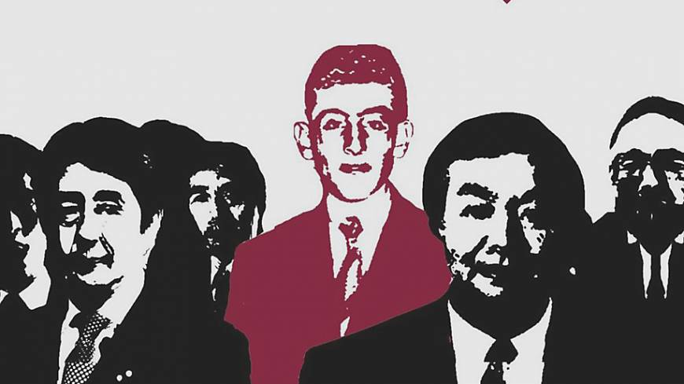

# | Introspection in  Wonderful Fool 

#### By Nikhil Chainani, Maxwell Lin, and David Jin
dodododododooooo dooooo doooo 
testing one two three
`rgb(9, 105, 218)`
***bold***
> quote

- 32312
- 23123
- 23123
- [x] doodoo

- [ ] \(Optional) Open a followup issue

footnotenesnnsenn [^1]

lalalalalalala
erwr

[^1]: This foornote

https://www.youtube.com/watch?v=e9mVfv3b-4E

 




<iframe width="560" height="315" src="https://www.youtube.com/embed/JLMbpiywVxQ" title="YouTube video player" frameborder="0" allow="accelerometer; autoplay; clipboard-write; encrypted-media; gyroscope; picture-in-picture" allowfullscreen></iframe>

 Some red text 
|

`rgb(9, 105, 218)`
**cooliois is _cool_ los**
`#0d1117`

`123`
this site was built using [ur mom](https://google.com)
[second page](second)
[main](README.md)
lets go real stuff:
## | section 2
Since his inception in interwar imperial Japan, Endo caught no breaks from the brutality of the world - within and without his home country. Stricken with sickness and strife, Endo diverged from the cultural stress on the supremacy of strength in which he was steeped in favour of aiding the ailing. Acutely affected by the abhorrent aspects of society, he sought solace in the theistic strive for their notion of a unified goodness. Writing relentlessly, he produced with profound prolificity, thus making it probable that every piece present in his publications is purposeful. From this perspective, consider that he presents a panorama of problems in Wonderful Fool: Tomoe’s hollow materialism, Takamori’s aimlessness, Osako’s vanity, Endo’s despair, bystanders’ carelessness, common tribalism, Kanai and Kobayashi’s selfishness, and societal stagnation. Think. What common thread underlies all of these myriad manifestations of a misguided world?

## | Part 3 script
There are various ways of answering this - many of which are likely worth consideration - but the issue we presently address is introspection - specifically the lack thereof in Wonderful Fool.
Before discussing it in the context of Wonderful Fool, however, the innate importance of introspection must be understood. Per Merriam-Webster, it is “a reflective looking inward: an examination of one’s own thoughts and feelings”. In short, it is a necessary component of significant growth as error analysis cannot truly function in its absence. Consider the following chain of thought:
- Susciety consists of individual people
- People can think about themselves (i.e. introspection)
- People make errors
- People can learn and improve from their errors
- This learning is most effective when the person thinks about why/how they erred (again, introspection)
- This is applicable to literally every facet of every person’s life as it is a fundamental component of human development
- Aggregated, these improvements (or lack thereof) make more competent members of susciety (or less)
- Moreover, this effect on susciety is self-reinforcing:
 
    Person is idiotic -> person behaves idiotically -> idiotic environment -> more idiots
    Less idiotic person -> less idiotic susciety -> less idiotic environment -> fewer idiots
    
So, in terms of global issue criteria:
1. Its significance is at the scale of anything and everything that can be affected by sentient beings
2. It is not only transnational but also transcends time and space altogether, seeing as it is an innately conceptual force

[Transnational scale](https://www.frontiersin.org/articles/10.3389/fnint.2012.00080/full)

3. It has innumerable impacts on every facet of life for any sentient creature that has existed long enough to make and learn from at least one error

Frankly, the evidence ought to speak for itself, but in case not - 
Works representative of the foundations of culture and society have, across temporal and spatial barriers alike, reflected the historically-sound rise in introspection which has been integral to the very roots of civilization and its gradual development. Though logic alone would suffice to demonstrate its scale and significance, empirical evidence of these does not get much clearer than this. So too is the case with everyday impacts, but to see this more concretely, note that introspection necessarily affects perception and perception necessarily affects behaviour, which, in turn, determines life experience. As you read about the drastically diverging directions of these two individuals’ lives, consider how each could have played out differently, had they reflected more or less.

[Example 1](https://www.reuters.com/world/us/deaths-reported-virginia-walmart-gunman-dead-police-say-2022-11-23/)

[Example 2](https://www.sciencedirect.com/science/article/pii/S0012160619303355?via%3Dihub)
